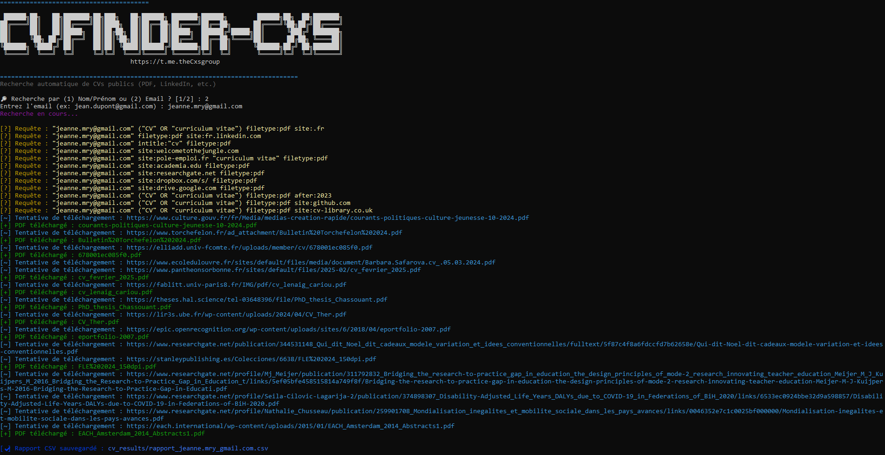

# 📄 CVFinder – Recherche Automatique de CVs Publics
<p align="center">
   
**CVFinder** est un outil en Python permettant de rechercher, télécharger et analyser des CVs publics (souvent au format PDF) à partir de recherches Google personnalisées ("Google Dorks").

---

## ⚙️ Fonctionnalités

- 🔎 Recherche de CVs publics via des requêtes Google ciblées
- 📥 Téléchargement automatique de fichiers PDF
- 🧠 Extraction d'informations clés :  
  - Email  
  - Numéro de téléphone  
  - Salaire mentionné  
  - Extrait du contenu du CV
- 📊 Génération automatique d’un rapport CSV
- 🗂️ Système de cache pour éviter les recherches répétées
- 🧾 Journalisation des erreurs dans un fichier log

---

## 🧱 Prérequis

- Python 3.x
- Modules requis :
  `requests`, `fitz` *(PyMuPDF)*, `googlesearch-python`, `colorama`, `re`, `csv`, `hashlib`, `concurrent.futures`, etc.

Installation rapide :

```bash
pip install requests pymupdf googlesearch-python colorama
